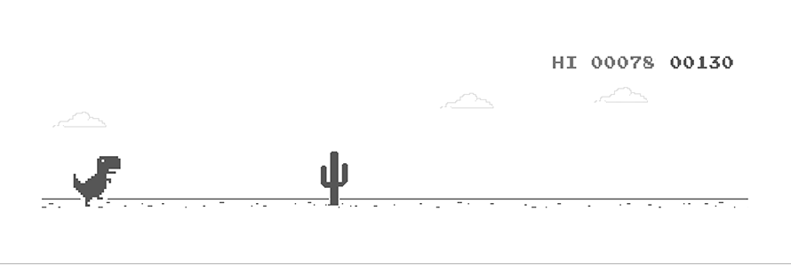

### Hey folks! 
 

 

 
Hi, I'm [Md. Mehedi Hasan Khan](https://mehedi-info.web.app/), a passionate self-taught Full Stack web developer  from Bangladesh. My passion for website lies with dreaming up ideas and making them come true with elegant interfaces. I take great care in the experience, architecture, and code quality of the things I build.

I am also an open-source enthusiast and maintainer. I learned a lot from the open-source community and I love how collaboration and knowledge sharing happened through open-source.

  
  
- 💬 Ask me about anything, I am happy to help;
- 📫 How to reach me: [@Mehedi](www.linkedin.com/in/mmhk-info);
- 📝 [Resume](https://drive.google.com/file/d/1vMESrVLiHr__k5HcIJDcRWEHBXEerXMR/view?usp=sharing)

### Languages and Tools:

<!--  -->
 
 
 
 
 
 
 
 
 
 

## Projects:
 ### Travel Solution:
  - It is a real life, user friendly, single page, full stack, React web application. User can easily take different kinds of travel services from my travel solution app.This web app also provides multi-services on travelling
  - Tools & Technologies: 
          - ReactJS
          - NodeJS
          - HTML5
          - CSS3
          - Material Ui
          - MongoDB
          - Firebase
          - Heroku
          - Git
  - Mechanisms: React Routing, Context api, Bootstrap, Material UI, react icons, react multi carousel, Firebase Auth, Heroku 
   
- Live Site: [https://travel-solution-bd.web.app](https://travel-solution-bd.web.app/)
- Git Repo.: [https://github.com/mmhk30313/Travel-Solution](https://github.com/mmhk30313/Travel-Solution)

### Book Life:
  - It's a single page web application. For user authentication firebase is used. It's look like a e-commerce book publication site.It has an admin panel for managing data
  - Tools & Technologies: 
          - ReactJS
          - NodeJS
          - HTML5
          - CSS3
          - Material Ui
          - MongoDB
          - Firebase
          - Heroku
          - Git
  - Mechanisms: React Routing, Context api, Bootstrap, Material UI, react icons, react multi carousel, Firebase Auth, Heroku 
   
- Live Site: [https://book-life-bd.web.app](https://book-life-bd.web.app/)
- Git Repo.: [https://github.com/mmhk30313/Book-Life](https://github.com/mmhk30313/Book-Life)

### Creative Agency:
   - A simple website can be used for any kind of agency. Any agency can be involved here and helps  others with their works. The website has an admin panel. So it can be             controlled by the admin
   - Tools & Technologies: 
          - ReactJS
          - NodeJS
          - HTML5
          - CSS3
          - Material Ui
          - MongoDB
          - Firebase
          - Heroku
          - Git
   - Mechanisms: React Routing, Context api, Bootstrap, React Spring, Material UI, Firebase Auth, Heroku 
  
- Live Site: [https://creative-agency-30313.web.app](https://creative-agency-30313.web.app)
- Git Repo.: [https://github.com/mmhk30313/creative-agency-client](https://github.com/mmhk30313/creative-agency-client)
 
 
 
 

 
 
 

 

